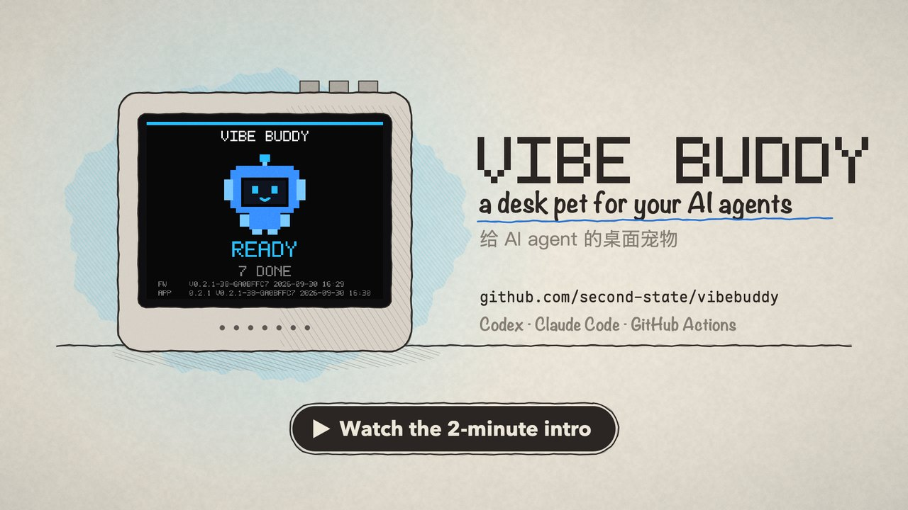
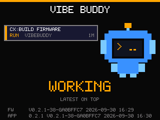
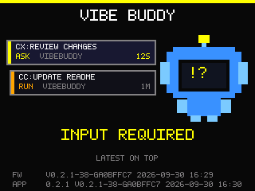
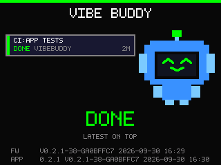
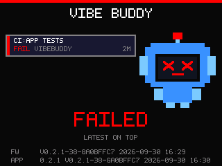
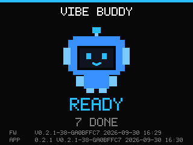
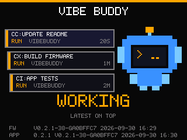
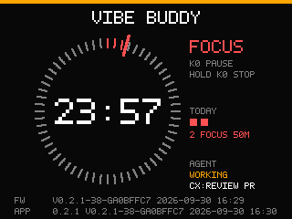
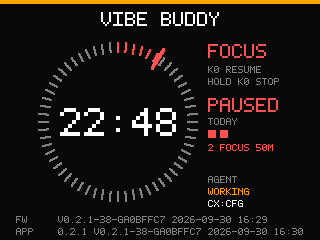

# Vibe Buddy

English | [简体中文](README.zh-CN.md)

Vibe Buddy is a desk pet for your AI coding agents. It lives in a small ESP32-S3 box next to your keyboard and keeps an eye on Codex, Claude Code and your GitHub Actions runs, so you don't have to. When an agent needs you, finishes, or fails, the buddy tells you with an animation, a task card and a short spoken line.

The buddy is an original character. Codex was the first agent it supported, but the device protocol isn't tied to any one client: any local program or script can send it events.

(The project used to be called VibeBuddy; the repository, the `vibebuddyd` daemon and the Vibe Buddy Protocol keep that name.)

[](https://www.youtube.com/watch?v=lLEFGSrcwDA)

**Rather not build one?** A ready-to-use Vibe Buddy, assembled, flashed and tested, is available for pre-order at [vibekeys.dev](https://vibekeys.dev/vibe-buddy.html?utm_source=github&utm_medium=readme&utm_campaign=vibe-buddy-launch). Everything it runs is the open-source code in this repository.

## On the box

Screen captures from a real box running the Rust firmware. Status scenes use example task names and daily stats; Pomodoro scenes show the live timer.

| Working | Input required |
| --- | --- |
|  |  |
| **Done** | **Failed** |
|  |  |
| **Ready** | **Multiple agents** |
|  |  |
| **Pomodoro focus** | **Pomodoro paused** |
|  |  |

## What it does

- **Watches your agents.** Codex, Claude Code and GitHub Actions all feed the same stack of up to three task cards, newest on top. Each card shows which agent it is (`CX:` Codex, `CC:` Claude Code, `CI:` GitHub Actions), the session's name and the project, and how long it has been in its current state.
- **Speaks up only when it matters.** The buddy shows idle, working, needs input, done, failed and disconnected. It says one short line when an agent needs your input, finishes or fails, and stays quiet while agents work.
- **Keeps today's stats.** When nothing is going on it cycles through what got done today and now and then does a little something.

It has three modes:

- **On duty** (the default): watches your agents and calls you when something happens.
- **Pomodoro**: a focus timer, 25 minutes of focus and 5 of break. K0 starts, pauses and resumes, and a long press gives up; K1 switches between On duty and Pomodoro; K2 still takes you to the agent's window, and a long press mutes. Each phase ends with a chime and a spoken line, and the next one waits for you to press K0. Today's finished sessions and focus time are kept on the box, reset daily, and survive a restart.
- **Leisure**: after On duty has been idle long enough, the buddy goes off to play. After five minutes it starts little skits (patrolling, kicking a ball, reading, counting stars, hide-and-seek, startling itself awake, talking in its sleep); after half an hour it gets sleepy and dims; at night, after 90 minutes of sleep, it turns the backlight off. Any agent activity or button press brings it straight back on duty.

Pomodoro runs entirely on the box: its timer and today's tally keep going without the Mac. Leisure's state also lives in the firmware, but it needs a live link to the daemon: if the box hears nothing from the Mac for 15 seconds it counts the link as lost, and Leisure returns to On duty until the link is back. Design notes: [`docs/pomodoro.md`](docs/pomodoro.md) and [`docs/leisure.md`](docs/leisure.md).

**Status:** the display and voice have passed on-device acceptance, and Codex, Claude Code and GitHub Actions are all connected. See [`docs/roadmap.md`](docs/roadmap.md) for what's next.

## What you need

- **The box:** a Vibe Buddy (ESP32-S3, 16 MB flash, 8 MB PSRAM), with LCD, speaker and three buttons. One USB-C cable powers it, flashes it and carries events. [Pre-order one](https://vibekeys.dev/vibe-buddy.html?utm_source=github&utm_medium=readme&utm_campaign=vibe-buddy-launch) that ships assembled and flashed, or see [`docs/hardware.md`](docs/hardware.md) to build your own.
- **A Mac** with Apple silicon and macOS 14 or later, or a Linux machine (experimental, see below).
- **At least one agent:** Codex or Claude Code. GitHub Actions support uses the `gh` CLI you're already signed in to.

## Getting started

1. Download `VibeBuddy-<version>-arm64.dmg` from the [latest release](https://github.com/second-state/vibebuddy/releases/latest) and drag Vibe Buddy to Applications.
2. Plug the box into the Mac.
3. Open Vibe Buddy. First-run setup walks you through:
   - finding the box (it blinks so you know it's the right one);
   - connecting Codex and Claude Code (you see the exact change to their hook config before it's written);
   - picking an announcement voice and writing it to the box;
   - launching at login.

After that Vibe Buddy lives in the menu bar; open the app again any time to bring up Settings. Its icon tells you whether the box is online, which mode it's in and how much got done today. Settings has five tabs: General (including the interface language), Sound, Agents, Device (firmware updates, screenshots) and Advanced. If the box's firmware differs from the one bundled with the app, Settings → Device offers to update it.

If a release isn't signed yet, macOS blocks the first launch; allow it under System Settings → Privacy & Security.

### Linux (experimental)

For x86_64 Linux with systemd; tested on Omarchy (Arch, Hyprland). Download `VibeBuddy-<version>-linux-x86_64.tar.gz` from the [latest release](https://github.com/second-state/vibebuddy/releases/latest), then:

```bash
tar xf VibeBuddy-<version>-linux-x86_64.tar.gz
cd VibeBuddy-<version>-linux-x86_64 && ./install.sh
```

On Arch and Omarchy you can install the same release as a pacman package instead. It goes in system-wide, and a udev rule gives you access to the box without joining a group:

```bash
git clone https://github.com/second-state/vibebuddy
cd vibebuddy/packaging/aur/vibebuddy-bin && makepkg -si
systemctl --user enable --now vibebuddyd && vibebuddy-hook install
```

It will be on the AUR as `vibebuddy-bin` once AUR registration reopens. To build from source instead, run `packaging/linux/install.sh` in a checkout with a Rust toolchain and python3; it builds everything and fetches the release's firmware from GitHub. Either way, the script installs the binaries into `~/.local/bin`, runs `vibebuddyd` as a systemd user service, puts the Vibe Buddy app in the launcher and at login, and adds the hooks to Claude Code and Codex, whichever this machine has (Codex then wants you to trust them in `/hooks`). Run it again to upgrade. The daemon needs to be in the group that owns `/dev/ttyACM*` (`uucp` on Arch, `dialout` on Debian and Ubuntu); the script tells you if it isn't. Config lives in `~/.config/vibebuddy`, stats in `~/.local/state/vibebuddy`, and when the box is gone for 30 seconds you get a desktop notification through `notify-send`.

On Hyprland, K2 brings back the terminal window the session runs in, on whatever workspace it is; a session inside tmux or over SSH has no window to go back to. The app is a tray icon (the buddy's face; click it for settings) plus a settings window with the same tabs as on the Mac. It takes its colors and font from the Omarchy theme and follows theme switches. It is only a client: quitting it leaves the daemon, and the box, running. Device → Refresh shows what the box's screen shows, and Save image puts it in your Pictures folder. Sound lists the voice packs the script built and writes the one you pick to the box; Device offers the firmware of this release (downloaded by the script and checked against GitHub's sha256) when the box runs a different build. The first launch opens the settings window, and so does launching the app again while it runs; there is no separate onboarding, since the script does that work. Omarchy keeps tray icons in a drawer behind the bar's chevron, so the app pins its face to the bar the first time it runs; unpin or hide it there (right-click the chevron) and it stays that way. General → Language overrides the system language, as on the Mac. To make the settings window float on Omarchy, add `o.window("^vibebuddy$", { tag = "+floating-window" })` and `o.window("^vibebuddy$", { tag = "-default-opacity" })` to `~/.config/hypr/hyprland.lua` (one tag per rule: Hyprland reads a space as part of the tag name); like every Hyprland window it moves with Super + drag. To remove everything, run `vibebuddy-hook uninstall`, then `systemctl --user disable --now vibebuddyd`, then delete the files the script installed.

## How it works

```text
Local programs / agents / Codex / scripts
                |
                | HTTP / Unix socket
                v
             vibebuddyd
                |
                | transport abstraction
                v
          USB Serial / USB CDC
                |
                v
           ESP32-S3 box
                |
      LCD / speaker / buttons
```

- `vibebuddyd`: the local daemon. It takes in events, connects to the box, reconnects, routes and keeps state.
- `beacon`: a command-line client that only talks to `vibebuddyd` and never opens the serial port itself (planned).
- `vibebuddy-fw`: the ESP32-S3 firmware. It only handles device I/O and Vibe Buddy Protocol messages.
- Vibe Buddy Protocol: an extensible NDJSON protocol, independent of the transport.

### Agents

Codex and Claude Code connect through local hooks. Both feed the same aggregator, and the task card's first line is the name the agent gave the session (the Claude app's conversation title, or Codex's thread name or branch), with the project name on the second line. Without a session name the project name goes first. The project name comes from the git root, so working in a subdirectory or worktree still shows the project.

The hook is a Rust binary in [`hook/`](hook/) (`vibebuddy-hook codex` / `vibebuddy-hook claude`). The app copies it to `~/Library/Application Support/VibeBuddy/bin/` and writes it into your user-level config, so it needs no Python and keeps working if you move the app (ADR-0005).

- Codex: six events in `~/.codex/hooks.json`. After they're written, review and trust them once on Codex's `/hooks` page. See [`docs/codex-adapter.md`](docs/codex-adapter.md).
- Claude Code: eight events in `~/.claude/settings.json`. See [`docs/claude-adapter.md`](docs/claude-adapter.md).

**Privacy:** the hook only forwards session and turn IDs, event names and the working directory. It never forwards prompts, assistant replies, transcripts or tool results. Both agents share the same rule for deciding whether the assistant is waiting for your answer.

### GitHub Actions

GitHub Actions doesn't use a hook: `vibebuddyd` polls `gh run list` every 30 seconds, using your existing GitHub login. **There's nothing to configure.** The repositories to watch are the projects an agent worked in during the last hour, and `owner/repo` is read from the `origin` remote in `.git/config`. See [`docs/ci.md`](docs/ci.md).

### Sending your own events

Anything that can make an HTTP request can put a card on the box:

```bash
curl -H 'content-type: application/json' \
  --data '{"version":1,"event":"task.done","title":"Hello"}' \
  http://127.0.0.1:7331/v1/events
```

See [`docs/protocol.md`](docs/protocol.md) for the events.

## Development

Everyday tasks live in the [`justfile`](justfile); run `just` to list them. See [`CONTRIBUTING.md`](CONTRIBUTING.md) for how to set up, test and send changes. The docs to start with are [`docs/architecture.md`](docs/architecture.md) (boundaries and decisions), [`CONTEXT.md`](CONTEXT.md) (domain terms), [`docs/pet.md`](docs/pet.md) (the buddy's design), [`docs/protocol.md`](docs/protocol.md) (protocol decisions), [`docs/references.md`](docs/references.md) (what we borrow from other projects, and where we stop) and [`LESSONS.md`](LESSONS.md) (lessons learned).

### Repository layout

```text
app/       # the macOS menu bar app (SwiftPM)
desktop/   # the Linux tray app and settings window (iced)
daemon/    # vibebuddyd
hook/      # vibebuddy-hook, the Codex and Claude Code hook
protocol/  # Vibe Buddy Protocol types and codec
firmware-rs/  # vibebuddy-fw in Rust: core (no hardware) and device (hardware glue)
firmware/  # the previous C firmware (ESP-IDF), kept as a fallback
voices/    # announcement voices, one directory per voice
docs/      # architecture, protocol, hardware evidence, roadmap
tools/     # detection, flashing and asset scripts
```

### Firmware

The firmware is Rust (esp-hal + embassy, `no_std`) in two layers: [`firmware-rs/core`](firmware-rs/core) holds all the logic that doesn't touch hardware, and [`firmware-rs/device`](firmware-rs/device) is only hardware glue. The reasoning is in [ADR-0006](docs/adr/0006-firmware-in-rust-with-esp-hal.md), and the first on-device acceptance steps are in [`docs/firmware-bringup.md`](docs/firmware-bringup.md).

Install the Xtensa toolchain and espflash once:

```bash
cargo install espup espflash --locked
espup install --targets esp32s3
```

Connect the box's `USB-SLAVE` port, then:

```bash
just flash /dev/cu.usbmodem8401
uv run --with pyserial python tools/serial-hello.py /dev/cu.usbmodem8401
```

`just flash` builds the three images (bootloader, partition table, app) and writes them with espflash. It leaves the `voices` partition and the settings area alone, so changing firmware keeps your voice.

Before flashing you can check the hardware-independent parts on the Mac: `just test-firmware` runs the firmware-core tests (state machine, drawing, serial protocol, storage, codec sequences) and compares the Rust and C firmware's screens pixel by pixel.

The firmware uses the custom partition table in [`firmware/partitions.csv`](firmware/partitions.csv) (a 4 MB app partition), because the voice assets no longer fit in the default 1 MB. espflash can't parse the custom subtype of the `voices` partition, so [`tools/make-partition-table.py`](tools/make-partition-table.py) compiles the table; the result matches ESP-IDF's `gen_esp32part.py` byte for byte.

The C firmware (`firmware/`, ESP-IDF) stays as a fallback until the Rust firmware finishes on-device acceptance: `just flash-c /dev/cu.usbmodem8401` flashes it back.

If the box is only connected through its `UART` port (the CH343 bridge, `/dev/cu.usbmodem5909…`), don't use `just flash`: with the default write block size it erases flash and then fails to write. Use [`tools/flash-bridge.sh`](tools/flash-bridge.sh), which flashes with `--no-stub` and 256-byte blocks, writing the partition table first as a test and then the app:

```bash
launchctl bootout gui/$(id -u)/com.vibebuddy.vibebuddyd
tools/build-firmware.sh
./tools/flash-bridge.sh /dev/cu.usbmodem59090668961 partition
./tools/flash-bridge.sh /dev/cu.usbmodem59090668961 app
launchctl bootstrap gui/$(id -u) ~/Library/LaunchAgents/com.vibebuddy.vibebuddyd.plist
```

`just flash` overwrites whatever firmware is on the box, including the factory `xiaozhi` firmware. Back it up first if you might want it back.

To find the box's serial port, run the probe once with the box unplugged and once plugged in:

```bash
./tools/detect-device.sh baseline
./tools/detect-device.sh connected
diff -ru .probe/baseline .probe/connected
```

The results can include your machine's USB device identifiers, so `.probe/` is ignored by Git.

### The app

The Mac app is a menu bar app. It carries `vibebuddyd` and `vibebuddy-hook` inside its bundle and supervises the daemon, replacing the old LaunchAgent. If it finds the old LaunchAgent, it offers to remove it and take over. Design: [`docs/app.md`](docs/app.md).

```bash
just firmware   # the three firmware images; a Release build needs them, build-app.sh --debug doesn't
just install    # build the app, install it to /Applications and launch it
```

The app builds with SwiftPM and only needs the command-line tools. `swift run --package-path app SelfTest` runs the view-model self-test.

### The daemon

Run `vibebuddyd` on its own:

```bash
cargo run -p vibebuddyd
```

By default it only listens on `127.0.0.1:7331` and finds the box by its Espressif USB Serial/JTAG ID, `VID:PID 303A:1001`. `VIBEBUDDY_BIND` changes the listen address, `VIBEBUDDY_SERIAL_PORT` names a serial port explicitly, and `VIBEBUDDY_USB_SERIAL` picks one box among several identical ones. HTTP `202 Accepted` means the event entered the bounded send queue; whether the box actually received it is what the daemon logs from the box's reply.

The app normally supervises the daemon. On a development machine without the app you can install it as a LaunchAgent with [`packaging/com.vibebuddy.vibebuddyd.plist`](packaging/com.vibebuddy.vibebuddyd.plist), but don't run both: they'd fight over the serial port. For the app, the daemon also serves `GET /v1/status`, SSE `/v1/status/stream`, `/v1/config`, `/v1/device/{identify,screenshot,voice-pack,firmware}` and `/v1/daemon/restart`.

When sending through the box's CH343 UART bridge, the daemon writes in line-rate chunks: the bridge can't take more than about two hundred bytes of continuous data and garbles the content without changing its length. The native USB port doesn't have this problem. See [`LESSONS.md`](LESSONS.md).

### Releases

CI builds releases; see [`release-app`](.github/workflows/release-app.yml). It builds the firmware on Linux, then the Mac app on an Apple silicon runner (packed into a DMG with `app/scripts/make-dmg.sh`) and the Linux tarball on Ubuntu 22.04 (`packaging/linux/make-tarball.sh`), testing on both.

- Commits on main that touch what goes into the packages (`app/`, `daemon/`, `desktop/`, `hook/`, `protocol/`, `firmware/`, `voices/`, `packaging/`) only produce test artifacts kept for 7 days.
- A `vX.Y.Z` tag notarizes the app and publishes one GitHub Release with the DMG, the Linux tarball and the firmware zip. The tag must match `version` in `Cargo.toml`, or the build fails.
- Before releasing, write `docs/releases/vX.Y.Z.md`: a few bullets on what the version does. It opens the release notes, and CI adds the downloads after it.
- Then releasing is one command on a clean main: `just release 0.3.0` checks that file, updates the versions in `Cargo.toml` and both lockfiles, commits, tags and pushes.
- `VibeBuddy-firmware-vX.Y.Z.zip` holds the three firmware images plus `build.txt`. Anyone with it can flash a box from Settings → Device → Flash from file… on the Mac.
- Builds are arm64 for the Mac and x86_64 for Linux. After a release, `packaging/aur/README.md` says how to update the AUR package.

With the five signing secrets set on the repository, releases are signed with a Developer ID and notarized, so they open straight after download. Without them the build falls back to ad-hoc signing, and the first launch has to be allowed under Privacy & Security. [`tools/setup-release-signing.sh`](tools/setup-release-signing.sh) sets the secrets up: it walks you through requesting the certificate, packing the p12 and creating an app-specific password, then checks each one before writing it to GitHub.

## License

The source code is licensed under the [GNU General Public License v3.0 or later](LICENSE). That covers everything that draws the buddy, too, since its look and animations are defined in code.

The voice audio we hold the rights to, and any artwork added later, is licensed under [CC BY-SA 4.0](LICENSE-ASSETS). The two Chinese voices in `voices/` come from Volcano Engine's speech service and aren't covered; [`LICENSE-ASSETS`](LICENSE-ASSETS) lists exactly what is.

Neither license grants rights to the name "Vibe Buddy" or the buddy character as a trademark.
