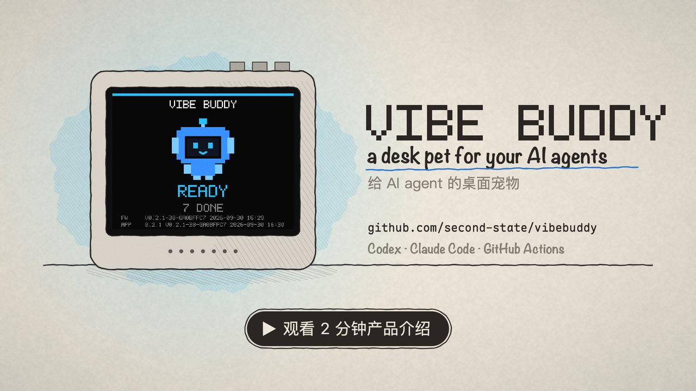

# Vibe Buddy

[English](README.md) | 简体中文

Vibe Buddy 是给 AI 编程 Agent 配的桌面宠物。它住在键盘旁一个小小的 ESP32-S3 盒子里，替你盯着 Codex、Claude Code 和 GitHub Actions：Agent 需要你、做完了或者失败了，氛围小助手会用动画、任务卡片和一句短语音告诉你。

氛围小助手是原创角色。Codex 是第一个接入的 Agent，但设备协议不绑定某个客户端，本机任何程序或脚本都能给它发事件。

（项目原名 VibeBuddy，仓库、`vibebuddyd` 守护进程与 Vibe Buddy Protocol 沿用旧名。）

[](https://www.youtube.com/watch?v=lLEFGSrcwDA)

**不想自己动手？** 组装好、刷好固件并测试过的 Vibe Buddy 成品已在 [vibekeys.dev](https://vibekeys.dev/vibe-buddy.html?utm_source=github&utm_medium=readme&utm_campaign=vibe-buddy-launch) 开放预订，运行的就是本仓库里的开源代码。

## 盒子上的画面

以下截图来自运行 Rust 固件的实机。状态场景使用示例任务名称和每日统计，番茄钟场景展示实际运行中的计时器。

| 工作中 | 等待输入 |
| --- | --- |
|  |  |
| **已完成** | **失败** |
|  |  |
| **待机** | **多个 Agent** |
|  |  |
| **番茄钟专注** | **番茄钟暂停** |
|  |  |

## 它做什么

- **盯着你的 Agent。** Codex、Claude Code 与 GitHub Actions 共用同一个任务卡栈，最多 3 张，最新在最上。每张卡标明是哪个 Agent（Codex 为 `CX:`，Claude Code 为 `CC:`，GitHub Actions 为 `CI:`）、会话名和项目，以及它在当前状态里待了多久。
- **有事才开口。** 氛围小助手有空闲、工作中、需要确认、完成、失败和失联几种状态。需要确认、完成和失败各播报一次短语音，工作中保持安静。
- **记着当日战绩。** 没事的时候轮播今天干了多少，偶尔做个小动作。

它有三个模式：

- **值班**（默认）：盯着 Agent，有事叫你。
- **番茄钟**：给你计时，专注 25 分钟、休息 5 分钟。K0 开始、暂停、继续，长按放弃；K1 在值班与番茄钟之间切换，长按打开盒子上的菜单（音量、静音、状态）；K2 照旧带你回到 Agent 所在的窗口，长按静音。阶段结束响铃并播报，下一阶段等你按 K0 再开始。今天完成了几次、专注了多久记在盒子上，按日清零，重启不丢。
- **休闲**：值班空闲够久之后它自己去玩。五分钟后开始演小剧目（巡逻、踢球、看书、数星星、躲猫猫、被自己吓醒、梦话），半小时后困了转暗睡觉，夜里睡够 90 分钟关背光。Agent 一有动静或按任何键，立刻回来值班。

番茄钟完全在盒子上运行，计时和当日次数不依赖 Mac 端。休闲的状态同样在固件里，但它需要与 daemon 的链路在线：盒子 15 秒收不到 Mac 的消息就判定链路断开，休闲随即回到值班，链路恢复前不会再进入。设计见 [`docs/pomodoro.md`](docs/pomodoro.md) 与 [`docs/leisure.md`](docs/leisure.md)。

**当前状态：** 显示与语音已通过实机验收，Codex、Claude Code 与 GitHub Actions 均已接入。接下来做什么见 [`docs/roadmap.md`](docs/roadmap.md)。

## 需要准备

- **盒子：** 一台 Vibe Buddy（ESP32-S3，16 MB Flash，8 MB PSRAM），带 LCD、扬声器和三个按键。一根 USB-C 线同时供电、烧录和传事件。可以直接[预订成品](https://vibekeys.dev/vibe-buddy.html?utm_source=github&utm_medium=readme&utm_campaign=vibe-buddy-launch)，组装和刷机都已完成；想自己做，硬件说明见 [`docs/hardware.md`](docs/hardware.md)。
- **一台 Mac：** Apple 芯片，macOS 14 或更新；也可以是一台 Linux 机器（实验性，见下文）。
- **至少一个 Agent：** Codex 或 Claude Code。GitHub Actions 用的是你已经登录好的 `gh` 命令行。

## 上手

1. 从[最新 Release](https://github.com/second-state/vibebuddy/releases/latest) 下载 `VibeBuddy-<版本>-arm64.dmg`，把 Vibe Buddy 拖进「应用程序」。
2. 把盒子插上 Mac。
3. 打开 Vibe Buddy，首次启动的引导会带你：
   - 找到盒子（它会眨眼，确认是这一台）；
   - 接入 Codex 与 Claude Code（写 Hook 配置前先展示改动）；
   - 挑一个播报音色写进盒子；
   - 设置登录时启动。

之后 Vibe Buddy 住在菜单栏，随时再打开一次 App 就能调出设置：图标告诉你盒子在不在线、什么模式、今天干了多少。设置窗有五页：通用（含界面语言）、声音、接入、设备（固件更新、截图）、高级。盒子上的固件与 App 附带的不一致时，设置 → 设备会提供更新。

Release 若还没签名，macOS 会拦下第一次打开，到「系统设置 → 隐私与安全性」里放行即可。

### Linux（实验性）

适用于带 systemd 的 x86_64 Linux，已在 Omarchy（Arch、Hyprland）上验证。从[最新 Release](https://github.com/second-state/vibebuddy/releases/latest) 下载 `VibeBuddy-<版本>-linux-x86_64.tar.gz`，然后：

```bash
tar xf VibeBuddy-<版本>-linux-x86_64.tar.gz
cd VibeBuddy-<版本>-linux-x86_64 && ./install.sh
```

在 Arch 和 Omarchy 上，也可以把同一个版本装成 pacman 包。它装在系统目录里，并附带一条 udev 规则，不用加组就能访问盒子：

```bash
git clone https://github.com/second-state/vibebuddy
cd vibebuddy/packaging/aur/vibebuddy-bin && makepkg -si
systemctl --user enable --now vibebuddyd && vibebuddy-hook install
```

等 AUR 重新开放注册后，它会以 `vibebuddy-bin` 上架。想从源码编译的话，在装好 Rust 工具链和 python3 的仓库里运行 `packaging/linux/install.sh`，它会编译所有程序，并从 GitHub 下载这个版本的固件。两种方式都一样：脚本把程序装进 `~/.local/bin`，把 `vibebuddyd` 注册成 systemd 用户服务，把 Vibe Buddy App 放进启动器并设为登录时启动，再给本机有的 Claude Code 和 Codex 加上 Hook（Codex 之后需要你在 `/hooks` 里信任它们）。升级时重新运行即可。daemon 要在 `/dev/ttyACM*` 所属的组里（Arch 是 `uucp`，Debian 和 Ubuntu 是 `dialout`），不在的话脚本会提示。配置放在 `~/.config/vibebuddy`，统计放在 `~/.local/state/vibebuddy`；盒子断开 30 秒后会通过 `notify-send` 弹一条桌面通知。

在 Hyprland 上，K2 会切回会话所在的终端窗口，不管它在哪个工作区；跑在 tmux 里或通过 SSH 的会话没有窗口可回。App 是一个托盘图标（氛围小助手的脸，点一下打开设置）加一个设置窗口，标签页和 Mac 版一样。它从 Omarchy 主题取配色和字体，切换主题时会跟着变。它只是个客户端：退出它，daemon 和盒子照常在线。设备页点「刷新」能看到盒子当前的屏幕，「保存图片」会存进你的图片文件夹。声音页列出脚本生成的音色包，选中的会写进盒子；盒子上的固件和这个版本不同时，设备页会提供更新，固件由脚本下载并按 GitHub 记录的 sha256 校验。首次启动会打开设置窗口；没有单独的首次引导，那些事脚本已经做了。想让设置窗口在 Omarchy 上浮动显示，在 `~/.config/hypr/hyprland.lua` 里加两行 `o.window("^vibebuddy$", { tag = "+floating-window" })` 和 `o.window("^vibebuddy$", { tag = "-default-opacity" })`（每条规则只能写一个标签：Hyprland 会把空格当成标签名的一部分）；和所有 Hyprland 窗口一样，按住 Super 拖动就能移动它。卸载时先运行 `vibebuddy-hook uninstall`，再运行 `systemctl --user disable --now vibebuddyd`，然后删掉脚本装的文件。

## 工作原理

```text
Local programs / agents / Codex / scripts
                |
                | HTTP / Unix socket
                v
             vibebuddyd
                |
                | transport abstraction
                v
          USB Serial / USB CDC
                |
                v
           ESP32-S3 box
                |
      LCD / speaker / buttons
```

- `vibebuddyd`：本机守护进程，负责事件接入、设备连接、重连、路由和状态。
- `beacon`：只调用 `vibebuddyd` 的命令行客户端，不直接占用串口（计划中）。
- `vibebuddy-fw`：ESP32-S3 固件，仅负责设备 I/O 和 Vibe Buddy Protocol 消息处理。
- Vibe Buddy Protocol：与 transport 解耦的可扩展 NDJSON 协议。

### Agent 接入

Codex 与 Claude Code 都由本机 Hook 接入，两者写入同一个聚合器。任务卡第一行写 Agent 自己给会话起的名字（Claude App 的会话标题、Codex 的线程名或分支），第二行写项目名；会话没有名字时第一行就是项目名。项目名取自 git 项目根，因此在子目录或 worktree 中工作时显示的仍是项目名。

Hook 是一个 Rust 二进制 [`hook/`](hook/)（`vibebuddy-hook codex` / `vibebuddy-hook claude`），App 把它复制到 `~/Library/Application Support/VibeBuddy/bin/` 并写进用户级配置；不依赖 Python，App 挪位置也不断（ADR-0005）。

- Codex：`~/.codex/hooks.json` 的六个事件，写入后要在 Codex 的 `/hooks` 页面审查、信任一次；详见 [`docs/codex-adapter.md`](docs/codex-adapter.md)。
- Claude Code：`~/.claude/settings.json` 的八个事件；详见 [`docs/claude-adapter.md`](docs/claude-adapter.md)。

**隐私：** Hook 只转发会话与回合标识、事件名和工作目录，不转发 prompt、助手回复、transcript 或工具结果。判断助手是否在等待回答的规则两个 Agent 共用。

### GitHub Actions

GitHub Actions 不走 Hook，由 `vibebuddyd` 每 30 秒用 `gh run list` 主动轮询，沿用你已有的 GitHub 登录。**不需要配置**：关注哪些仓库由 Agent 最近一小时工作过的项目自动推导，`owner/repo` 从 `.git/config` 的 `origin` 远端读出。详见 [`docs/ci.md`](docs/ci.md)。

### 自己发事件

能发 HTTP 请求的都能往盒子上放一张卡：

```bash
curl -H 'content-type: application/json' \
  --data '{"version":1,"event":"task.done","title":"Hello"}' \
  http://127.0.0.1:7331/v1/events
```

事件列表见 [`docs/protocol.md`](docs/protocol.md)。

## 开发

日常操作都收在根目录的 [`justfile`](justfile) 里，`just` 列出全部。如何搭环境、跑测试、提交改动见 [`CONTRIBUTING.md`](CONTRIBUTING.md)（英文）。先读这些：[`docs/architecture.md`](docs/architecture.md)（边界与决定）、[`CONTEXT.md`](CONTEXT.md)（领域词汇）、[`docs/pet.md`](docs/pet.md)（氛围小助手设计）、[`docs/protocol.md`](docs/protocol.md)（协议决定）、[`docs/references.md`](docs/references.md)（外部项目的借鉴边界）和 [`LESSONS.md`](LESSONS.md)（经验教训）。

### 仓库布局

```text
app/       # macOS 菜单栏 App（SwiftPM）
desktop/   # Linux 托盘 App 和设置窗口（iced）
daemon/    # vibebuddyd
hook/      # vibebuddy-hook，Codex 与 Claude Code 的 Hook
protocol/  # Vibe Buddy Protocol 类型与编解码
firmware-rs/  # Rust 版 vibebuddy-fw：core（不碰硬件）与 device（硬件胶水）
firmware/  # 之前的 C 固件（ESP-IDF），保留作退路
voices/    # 播报音色，一个音色一个目录
docs/      # 架构、协议、硬件证据和路线图
tools/     # 探测、烧录与素材脚本
```

### 固件

固件是 Rust（esp-hal + embassy，`no_std`），分两层：[`firmware-rs/core`](firmware-rs/core) 放所有不碰硬件的逻辑，[`firmware-rs/device`](firmware-rs/device) 只做硬件胶水。取舍见 [ADR-0006](docs/adr/0006-firmware-in-rust-with-esp-hal.md)，第一次上机的验收步骤见 [`docs/firmware-bringup.md`](docs/firmware-bringup.md)。

先装一次 Xtensa 工具链与 espflash：

```bash
cargo install espup espflash --locked
espup install --targets esp32s3
```

连接盒子的 `USB-SLAVE` 口后执行：

```bash
just flash /dev/cu.usbmodem8401
uv run --with pyserial python tools/serial-hello.py /dev/cu.usbmodem8401
```

`just flash` 先构建三件套（bootloader、分区表、app）再用 espflash 写入，`voices` 分区与设置区不动，换固件不丢音色。

烧录前可以在 Mac 上验证固件里不依赖硬件的部分：`just test-firmware` 跑 firmware-core 的测试（状态机、绘制、串口协议、存储、codec 序列），并把 Rust 与 C 两份固件的画面逐像素比对。

固件使用 [`firmware/partitions.csv`](firmware/partitions.csv) 的自定义分区表（app 分区 4 MB），因为语音资产已经装不进默认的 1 MB。espflash 解析不了其中 `voices` 分区的自定义子类型，所以分区表由 [`tools/make-partition-table.py`](tools/make-partition-table.py) 编译，结果与 ESP-IDF 的 `gen_esp32part.py` 逐字节一致。

C 固件（`firmware/`，ESP-IDF）在 Rust 版实机验收完成前保留作退路：`just flash-c /dev/cu.usbmodem8401` 刷回去。

盒子若只接着 `UART` 口（CH343 桥，`/dev/cu.usbmodem5909…`），不要用 `just flash`：那条路在默认写块下会把 flash 擦掉后写不进去。用 [`tools/flash-bridge.sh`](tools/flash-bridge.sh)，它以 `--no-stub` 加 256 字节写块烧录，先单独写分区表试路，再写 app：

```bash
launchctl bootout gui/$(id -u)/com.vibebuddy.vibebuddyd
tools/build-firmware.sh
./tools/flash-bridge.sh /dev/cu.usbmodem59090668961 partition
./tools/flash-bridge.sh /dev/cu.usbmodem59090668961 app
launchctl bootstrap gui/$(id -u) ~/Library/LaunchAgents/com.vibebuddy.vibebuddyd.plist
```

`just flash` 会覆盖盒子上现有的固件，包括出厂的 `xiaozhi` 固件；日后可能想刷回去的话，先做好备份。

想找盒子的串口，在盒子未连接和已连接两种状态下各跑一次探测：

```bash
./tools/detect-device.sh baseline
./tools/detect-device.sh connected
diff -ru .probe/baseline .probe/connected
```

探测结果可能包含本机 USB 设备标识，`.probe/` 默认不纳入 Git。

### App

Mac 端是一个菜单栏 App，它把 `vibebuddyd` 与 `vibebuddy-hook` 带在身上并看管 daemon，取代了 LaunchAgent；发现旧的 LaunchAgent 会提议卸掉并接管。设计见 [`docs/app.md`](docs/app.md)。

```bash
just firmware   # 固件三件套，Release 装包要附带；build-app.sh --debug 可以不带
just install    # 装包、装进 /Applications 并启动
```

App 用 SwiftPM 构建，只需要命令行工具；`swift run --package-path app SelfTest` 跑视图模型的自检。

### daemon

单独启动 `vibebuddyd`：

```bash
cargo run -p vibebuddyd
```

默认只监听 `127.0.0.1:7331`，并按 Espressif USB Serial/JTAG 的 `VID:PID 303A:1001` 自动发现设备。可用 `VIBEBUDDY_BIND` 修改监听地址、`VIBEBUDDY_SERIAL_PORT` 显式指定串口，或用 `VIBEBUDDY_USB_SERIAL` 在多块相同设备中选择目标。HTTP `202 Accepted` 表示事件进入有界发送队列；设备实际接收结果以 daemon 记录的设备响应为准。

daemon 平时由 App 看管。没有 App 的开发机可以用 [`packaging/com.vibebuddy.vibebuddyd.plist`](packaging/com.vibebuddy.vibebuddyd.plist) 装成 LaunchAgent，但两者不能同时跑，会抢串口。daemon 还为 App 提供 `GET /v1/status`、SSE `/v1/status/stream`、`/v1/config`、`/v1/device/{identify,screenshot,voice-pack,firmware}` 与 `/v1/daemon/restart`。

经盒子的 CH343 UART 桥发送时 daemon 按线速分段写：这条桥一次吞不下超过两百字节的连续数据，会把内容错位而长度不变；原生 USB 口不受影响。教训见 [`LESSONS.md`](LESSONS.md)。

### 发布

发布由 CI 完成，见 [`release-app`](.github/workflows/release-app.yml)：先在 Linux 上构建固件，再分别在 Apple 芯片的 runner 上构建 Mac App（用 `app/scripts/make-dmg.sh` 打成 DMG）、在 Ubuntu 22.04 上构建 Linux 包（`packaging/linux/make-tarball.sh`），两边都跑测试。

- main 上动到装包内容（`app/`、`daemon/`、`desktop/`、`hook/`、`protocol/`、`firmware/`、`voices/`、`packaging/`）的提交只出保留 7 天的 artifact 供自测。
- 打 `vX.Y.Z` 标签才公证并发 GitHub Release，同一个 Release 里有 DMG、Linux 包和固件 zip。标签必须与 `Cargo.toml` 的 `version` 一致，否则构建失败。
- 发版前先写 `docs/releases/vX.Y.Z.md`：用几条要点说这个版本做了什么。它是发布说明的开头，CI 会在后面接上下载说明。
- 然后发版一条命令：在干净的 main 上 `just release 0.3.0`，它检查那份文件，更新 `Cargo.toml` 和两份锁文件里的版本号，提交、打标签、推送。
- `VibeBuddy-firmware-vX.Y.Z.zip` 是固件三件套加 `build.txt`，拿到它的人在 Mac 上的设置 → 设备「从文件刷入…」里选它即可烧进盒子。
- Mac 出 arm64，Linux 出 x86_64。发布后怎么更新 AUR 包，见 `packaging/aur/README.md`。

仓库配齐五个签名 secrets 后用 Developer ID 签名并公证，下载即可打开；没配时退回 ad-hoc 签名，首次打开要在「隐私与安全性」里放行。secrets 用 [`tools/setup-release-signing.sh`](tools/setup-release-signing.sh) 配：它带着走完申请证书、打包 p12、生成 App 专用密码，并逐项验证后写进 GitHub。

## 许可证

源代码以 [GNU 通用公共许可证 v3.0 或更新版本](LICENSE)（GPL-3.0-or-later）授权。氛围小助手的样子和动画都在代码里定义，因此同样适用 GPL。

我们拥有权利的播报音频，以及日后加入的美术素材，以 [CC BY-SA 4.0](LICENSE-ASSETS) 授权。`voices/` 里的两个中文音色出自火山引擎的语音服务，不在此列；具体范围以 [`LICENSE-ASSETS`](LICENSE-ASSETS) 为准。

两份许可证都不授予「Vibe Buddy」名称或氛围小助手角色的商标权利。
