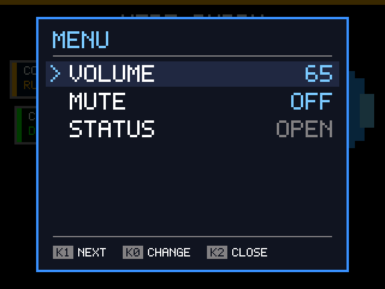
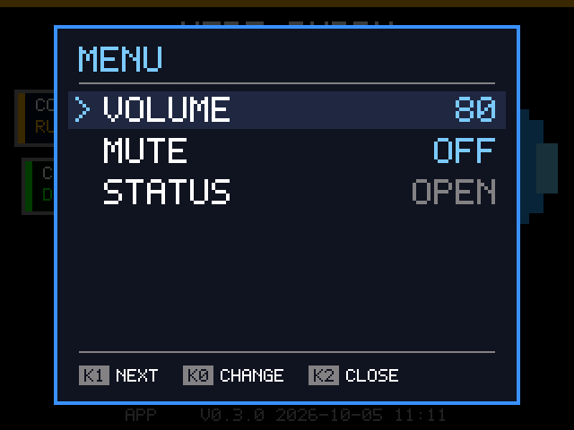
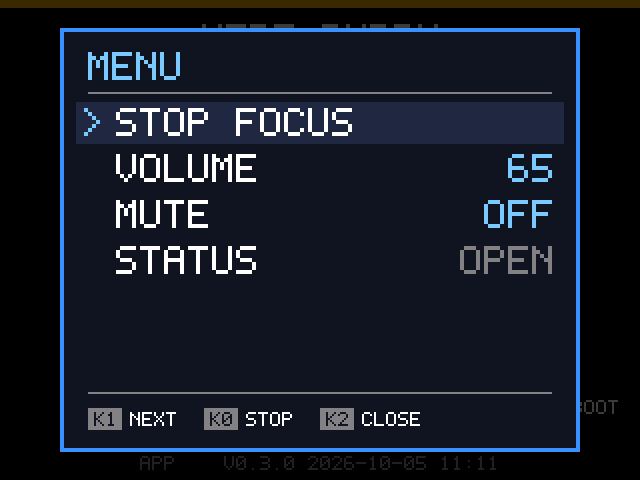
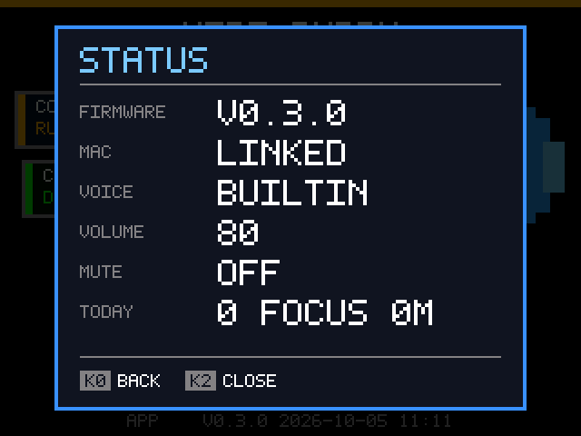

# Device menu

Status: built 2026-10-05. The screens below are rendered by the firmware itself on the Mac (`cargo run -p vibebuddy-firmware-core --example menu_preview -- <directory>`).

## Why

Every key gesture the box has is a separate thing to remember, and half of the six are hidden: K0, K1 and K2 each have a long press. Nothing on the screen says they exist, so they're found by reading the README or not at all. The box also can't show or change its own volume: that lives in the app.

The firmware of Meta's [Muse gadgets](https://github.com/facebookincubator/muse-gadget-sdk), which runs on boards much like this box, solves the same problem with two keys: one opens a menu and steps down it, the other acts on the selected row. Values cycle on each press, so the menu needs no long press, and hints on the screen say what each key does right now. This proposal takes that structure and keeps what VibeBuddy's keys are for.

## What stays one press away

The frequent actions keep their keys, unchanged:

| Gesture | Does | Change |
|---|---|---|
| K0 | Pomodoro start / pause / resume | none |
| K0 long | Give up the current phase | none (also in the menu) |
| K1 | Switch between On duty and Pomodoro | none |
| **K1 long** | ~~Leisure now~~ | **opens the menu** |
| K2 | Take me to the agent's window | none |
| K2 long | Mute toggle | none (also in the menu) |

Muse manages with two keys because many of its boards only have two. This box has three, and K2's jump back to the agent is the most used and most VibeBuddy thing it does, so K2 stays out of the menu's way. K1 long is the one to give up: Leisure starts on its own after a while on duty, and starting it on demand turned out to be of little use, so it isn't in the menu either.

## The menu

- **Opening**: K1 held for a second (the existing long-press threshold). It opens as soon as the long press fires, while K1 is still down; the release does nothing.
- **In the menu**: K1 moves to the next row (wrapping), K0 acts on the selected row, K2 closes. The keys keep a role close to their usual one: K1 is the mode-and-menu key, K0 the "do it" key, K2 the "get me out of here" key.
- **Closing**: K2, or 30 s without a key, as in Muse. The menu always opens on its first row.
- **Values cycle**: K0 on a value row steps to the next value and wraps. No long presses inside the menu.
- **Hints**: the bottom of the panel names what each key does in the current view.

### Rows

| Row | Shown | K0 does |
|---|---|---|
| STOP FOCUS / END BREAK | only while a phase is running, paused or waiting to start its break | gives up the phase, like K0 long, and closes the menu |
| VOLUME | always | steps 20 → 35 → 50 → 65 → 80 → 100 → 20 and plays the "All done!" line at the new level, as the app's preview does |
| MUTE | always | toggles mute, like K2 long |
| STATUS | always | opens the status view; K0 there goes back |

 

Volume steps are coarse on purpose: six presses cover the range, and the app's slider is still there for a value in between. A level set from the app that isn't a step (say 70) shows as 70 and moves to the next step up.

### Status

What the box knows about itself, with nothing to change: the firmware and app builds (version over build time, see [`pet.md`](pet.md#build-identifiers)), whether the Mac is linked, the voice pack and today's focus tally. Volume and mute aren't repeated here: the menu's own rows already show them. It's where "is it the box or the Mac?" gets answered without opening the app.

## Behavior around the menu

- **Agent events don't wait for the menu.** An event that needs the user (input required, failed) closes the menu so the screen can show it; its line is announced as usual. Other events (working, done) update the screen underneath and show once the menu closes. A Pomodoro phase ending closes the menu too, since its alarm needs K0.
- **Leisure** is left for On duty the moment the menu opens, like any key press today, and doesn't start while the menu is open.
- **Volume and mute stay where they are.** The menu changes the same values as the app and K2 long. A volume change from the menu prints the `VOLUME <n>` line `device.volume` already uses, so the daemon's status, and the app's slider, follow; mute keeps its `MUTE ON` / `OFF` lines and stays device-only, as [`app.md`](app.md) says.
- **Nothing moves to the box that belongs to the Mac.** Connecting agents, the voice library, firmware updates, launch at login and notifications all stay in the app: they need the Mac's files, network or system settings. The box holds one voice pack at a time, so there's nothing to choose between on it. The menu is about making the box's own controls visible, not about replacing the app.

## Constraints from the hardware

- **Backlight is on or off**: it is bit 7 of the XL9555 expander, not a PWM pin, so there is no brightness row.
- **The font is 5×7 ASCII** with gaps: no `/` or `+` (they draw as `\` and a stray glyph), so menu text avoids them. Labels are uppercase, as everywhere else on the screen.
- **Key positions**: the hints name the keys rather than pointing at them, since the case's key layout isn't drawn anywhere on screen today.

## Where it lives

All of it is firmware logic that doesn't touch hardware, in `firmware-rs/core` beside the Pomodoro and Leisure state machines: `menu.rs` decides what a key means in the menu (rows, selection, idle timeout), `firmware.rs` carries out the action and builds what the panel says, and `display.rs` draws a `Panel` over the screen. Volume, mute and giving up a phase each run through one function that the old gestures and the protocol share; the device layer needs nothing new. The firmware prints `MENU OPEN` and `MENU CLOSED` as diagnostic lines.

## Docs that change with it

`CONTEXT.md` (key terms), `README.md` and `README.zh-CN.md` (the Pomodoro paragraph), [`leisure.md`](leisure.md) (its "Long press K1" section), [`protocol.md`](protocol.md) (keys not reported, the `VOLUME` line now also sent unprompted), [`firmware-bringup.md`](firmware-bringup.md) (key checklist) and [`app.md`](app.md) (volume can change from the box). The key mapping change gets an ADR.

## Decisions

- The menu is built even though it has few rows: it gives the box's own controls a place to grow.
- STATUS stays about the box; agent detail stays on the cards.
- The panel covers the whole screen, buddy included, rather than a narrower panel beside it.
